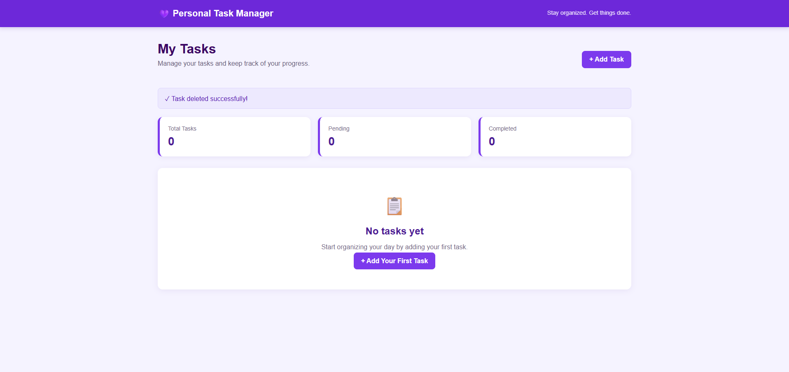

# Personal Task Manager

A Laravel-based Personal Task Manager that allows users to create, view, edit, delete, and update the status of tasks.

## Project Information

**Project Code:** WST21-PM-2026-SF

**Student Name:** Cindy Marie Jumao-as

**Course & Year:** BSIT 7

**Database Used:** SQLite

## Features

- Add Task
- View Tasks
- Edit Task
- Delete Task
- Update Status
  - Pending
  - Completed

## Task Fields

The tasks table contains:

- ID
- Task Name
- Description
- Status
- Due Date
- Created At
- Updated At

## Technologies Used

- Laravel
- PHP
- SQLite
- Blade
- HTML
- CSS

## Laravel Structure

The application follows the Laravel flow:

**Routes → Controller → Model → Database → Blade**

## Installation

## Screenshots

### Dashboard




### 1. Clone the repository

```bash
git clone https://github.com/cindykai33/Task--manager.git